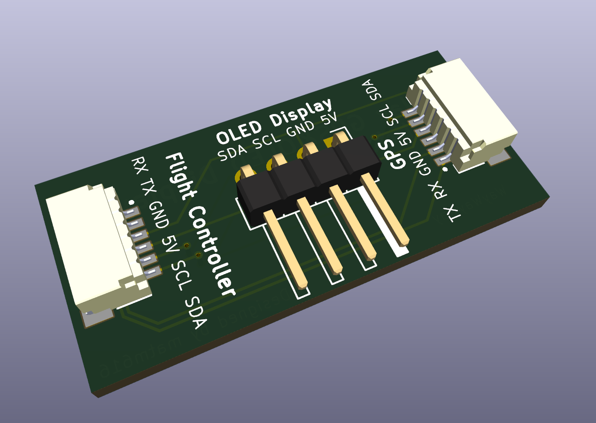

# iNav GPS OLED Splitter

A small PCB meant to take the plug usually meant for the GPS and split off I2C and 5V to hook up to a small OLED screen for use with iNav's [dashboard feature](https://github.com/iNavFlight/inav/blob/8.0.1/docs/Display.md).
